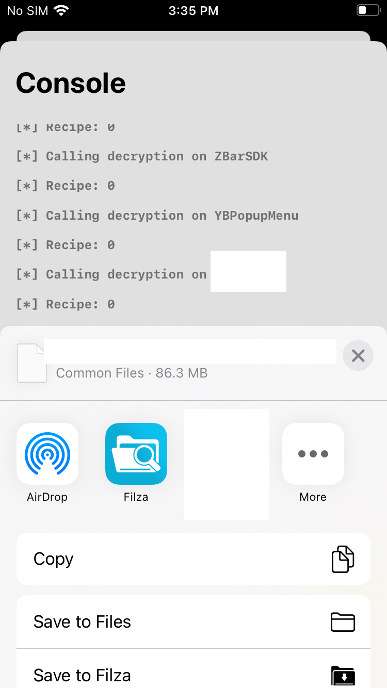
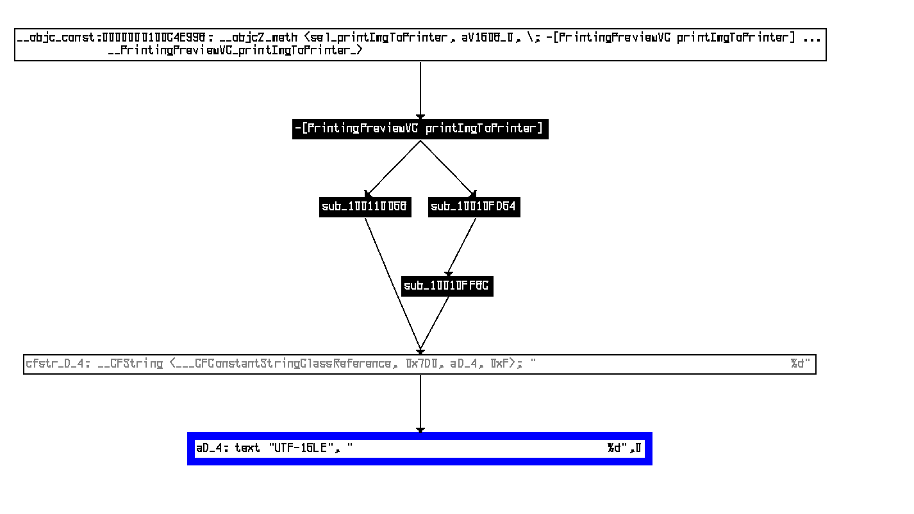

# 知识库

知识库记录了研发相关的过程，留以分享与学习。iOS 逆向相关的笔记和经验破解没有人来更新，多数工具链都已经过时。相比于传统的真机调试，笔者使用自己的工具链在 macOS 上调试 iOS 应用程序体验更好。（大概？）

尽管本文尝试将内容以最简单的方式表达，读者仍需拥有最基本的 iOS 和 Objective-C 开发能力以理解其中的内容。

## 大纲

- 获取程序
- 启动调试
- 关键方法
- 分析协议

## 获取程序

众所周知，林檎的应用程序是加密的。加密，但是不完全加密。具体来说，二进制通常会加密第一页。这样一来，二进制在没有解密的情况下一定无法运行，同时也不会再设备端消耗过多的性能。

在拥有越狱 iOS 设备的情况下，获取目标二进制非常简单。首先，从 App Store 下载并安装应用程。在下载完成以后，不需要运行程序。当前的二进制解密技术已经非常成熟，不再需要启动应用程序再从应用的内存中读取并转存。相比之下，使用 `mmap` 手动加载二进制并调用系统的 `mremap_encrypted` 完成静态解密，不再需要与应用程序的反调试机制斗智斗勇。解密可以考虑使用笔者和他的朋友们自研的 [工具](https://github.com/Lakr233/Iridium)。



如果没有越狱的 iOS 设备（没有越狱环境，即使安装完成也无法获取解密的安装包），可以考虑使用 [这个脚本](https://github.com/NyaMisty/action-ipadown) 从 iTunes 获取安装包，并在搭载 Apple Silicon 的 Mac 上使用 [这个脚本](https://github.com/paradiseduo/appdecrypt) 进行解密。在进行解密之前，请先确保这台电脑有打开过任意与从 iTunes 下载安装包时相同 Apple ID 安装的 iOS 应用程序，来初始化 `mremap_encrypted` 需要的钥匙串。

## 启动调试

由于 iOS 调试限制颇多，即使越狱也有诸多限制，且不能直接从终端启动二进制，笔者选择在 macOS 上进行调试。使用 [此处的脚本](https://github.com/Lakr233/AppleSiliconUIKitPatch) 通过魔改应用程序链接路径和二进制描述头，可以将 iOS 二进制转换成正常的 macOS 二进制。


在转换二进制的同时，解除调试限制的任务也完成了。在任何启用了开发者模式的电脑上，运行下面的指令便可以启动调试。

```bash
➜  lldb xx同学.app/xx同学
(lldb) target create "xx同学.app/xx同学"
Current executable set to '/Users/qaq/Desktop/xx同学.app/xx同学' (arm64).
(lldb) process launch 
Process 60930 launched: '/Users/qaq/Desktop/xx同学.app/xx同学' (arm64)
```

启动完成的二进制有一些奇怪，具体来说，布局是错乱的。这是因为在修改二进制时，我们将 UIKit 的符号从 iOS UIKit 迁移到了 Catalyst UIKit，他们对于 UIScreen 获取尺寸的实现并不相同。如果想要以 iOS UIKit 的方式调试二进制，可以选择使用重签名的方式。(在 macOS 上调试 iOS 应用程序需要有效的林檎开发者证书，要钱，而且很麻烦)


通过给 `UIScreen` 下断点，自动修改返回值可以解决这个问题。但显然，我们只需要调试关键的方法参数即可。

先进行一次打印。可以在应用程序控制台观察到关键输出：

```
2022-07-23 15:04:05.017173+0800 xx同学[60930:5802018] flow ctl pdu received, mtu = 160, credit = 4
2022-07-23 15:04:12.427261+0800 xx同学[60930:5802018] Printer接收到数据{length = 1, bytes = 0xaa}
2022-07-23 15:04:12.427471+0800 xx同学[60930:5802018] 哈哈打印结束了～～～～～～10000
2022-07-23 15:04:12.427493+0800 xx同学[60930:5802018] 打印结束了～～～～～～
```

喔唷！“哈哈打印结束了”！

## 关键方法

当然，你可以通过给 `NSLog` 下条件断点的方法获取堆栈，但笔者选择使用二进制扫描器。手头有 IDA 为啥不用捏？在等待 `The initial autoanalysis has been finished.` 以后便可以开始我们的分析。

首先，搜索字符串 “哈哈打印结束了”。要在二进制中搜索字符串，需要先选中任意二进制分析窗口（如果选中方法窗口则在方法中搜索）。


在等待搜索结束以后，跟踪 xref 找到方法。

```
Address	Function	Instruction
__ustring:0000000100B2CD0E		aD_4            text "UTF-16LE", "哈哈打印结束了～～～～～～%d",0
__cfstring:0000000100BA7EC8		cfstr_D_4       __CFString <___CFConstantStringClassReference, 0x7D0, aD_4, 0xF>
```




不难看出，`-[PrintingPreviewVC printImgForPrinter]` 是打印图像的起点。追踪这个方法，可以找到这样一行调用。仔细阅读可知 `-[ByPrinterManager sendImgToPrinter:repeatCount:color:callBack:]` 是我们要找的关键方法。

```c
v29 = +[ByPrinterManager shareManager](&OBJC_CLASS___ByPrinterManager, "shareManager");
v30 = (NSArray *)objc_retainAutoreleasedReturnValue(v29);
v31 = -[PoetryPrintPreviewViewController printingCount](self, "printingCount");
objc_msgSend(v30, "sendImgToPrinter:repeatCount:color:callBack:", v20, v31, v6, &stru_100B759D0);
```

在 `-[ByPrinterManager sendImgToPrinter:repeatCount:color:callBack:]` 中发现了方法 `sub_1001C5A6C`，其中调用了 `-[LuckPrinter luckDrawGraphic:Mode:]`。这应该就是我们的关键方法。

要想在 lldb 中断住这个方法，需要使用我和我的朋友们一起研发的调试工具 [xia0LLDB](https://github.com/4ch12dy/xia0LLDB) 中包含的脚本指令 `xbr`。传统的断点无法使用，最主要的原因是 Release 模式的编译进行了符号的优化，调试器无法直接寻找。在 Objective-C 中使用 NSClassFromString 和 NSSelectorFromString 可以获取基础对象，在获取到的基础对象中查找这个 Selector 的 IMPL 可以获取到方法。接下来使用 IMPL 的地址添加地址断点可以实现这个操作。

```
[按一下 Control + C 来停住这个程序]
Process 60930 stopped
* thread #1, queue = 'com.apple.main-thread', stop reason = signal SIGSTOP
    frame #0: 0x0000000191e4e8b0 libsystem_kernel.dylib`mach_msg_trap + 8
libsystem_kernel.dylib`mach_msg_trap:
->  0x191e4e8b0 <+8>: ret    

libsystem_kernel.dylib`mach_msg_overwrite_trap:
    0x191e4e8b4 <+0>: mov    x16, #-0x20
    0x191e4e8b8 <+4>: svc    #0x80
    0x191e4e8bc <+8>: ret    
Target 0: (xx同学) stopped.

(lldb) freshxlldb # 加载 xia0lldb
[xia0LLDB] * Version: 3.1 
[xia0LLDB] + Loading all scripts from /Users/qaq/xia0LLDB/src
[xia0LLDB] * Finished 

(lldb) xbr "-[LuckPrinter luckDrawGraphic:Mode:]"
[*] className:LuckPrinter methodName:luckDrawGraphic:Mode:
[+] found class address:0x100e11f20
[+] found selector address:0x100a6ad9c
[+] found method address:0x1007472c0
Breakpoint 1: where = xx同学`___lldb_unnamed_symbol34774$$xx同学, address = 0x00000001007472c0

(lldb) c # 恢复程序运行
Process 60930 resuming
```

接下来在打印的过程中，应用程序会停住。使用 `bt` 指令可以打出程序的调用堆栈。

```
Process 60930 stopped
* thread #25, stop reason = breakpoint 1.1
    frame #0: 0x00000001007472c0 xx同学`___lldb_unnamed_symbol34774$$xx同学
xx同学`___lldb_unnamed_symbol34774$$xx同学:
->  0x1007472c0 <+0>:  sub    sp, sp, #0x90
    0x1007472c4 <+4>:  stp    x29, x30, [sp, #0x80]
    0x1007472c8 <+8>:  add    x29, sp, #0x80
    0x1007472cc <+12>: mov    x8, #0x0
    0x1007472d0 <+16>: stur   x0, [x29, #-0x10]
    0x1007472d4 <+20>: stur   x1, [x29, #-0x18]
    0x1007472d8 <+24>: sub    x0, x29, #0x20
    0x1007472dc <+28>: stur   x8, [x29, #-0x20]
Target 0: (xx同学) stopped.

(lldb) bt
* thread #25, stop reason = breakpoint 1.1
  * frame #0: 0x00000001007472c0 xx同学`___lldb_unnamed_symbol34774$$xx同学
    frame #1: 0x00000001001c56d8 xx同学`___lldb_unnamed_symbol8388$$xx同学 + 648
    frame #2: 0x0000000192e3363c Foundation`__NSThread__start__ + 808
    frame #3: 0x0000000191e8c26c libsystem_pthread.dylib`_pthread_start + 148

(lldb) 
```

其中可以找到程序地址

```
0x00000001007472c0 <- -[LuckPrinter luckDrawGraphic:Mode:]
0x00000001001c56d8
0x0000000192e3363c __NSThread__start__
0x0000000191e8c26c libsystem_pthread
```

要查找 `0x00000001001c56d8` 的方法，需要先解决随机地址偏移（ASLR）。通过指令 `image list` 可以看到每一个加载的 `image` 的基址。可以看到此次启动的二进制没有开启随机地址。(0x0000000100000000 是 PageZero 的基础偏移)

```
(lldb) image list
[  0] 9C6C3944-807C-3A26-8C7C-0BF21664D38E 0x0000000100000000 /Users/qaq/Desktop/xx同学.app/xx同学 
[  1] D9C2A46E-8DC4-3950-9D6A-F799E8CCB683 0x0000000100f3c000 /usr/lib/dyld 
...
```

如果存在偏移，则可以通过下面的方法进行换算。

```
偏移 = 内存地址 - image 起点
offset = 0x00000001001c56d8 - 0x0000000100000000(正常情况不是这个，比如先启动进程再挂调试器)

分析器的地址 = 0x100000000 + 偏移
IDA_addr = 0x100000000(IDA 默认) + offset
```

可以推算地址 `0x00000001001c56d8` 为 `-[ByPrinterManager autoSendDataThreadProc]`

```
0x00000001007472c0 <- -[LuckPrinter luckDrawGraphic:Mode:]
0x00000001001c56d8 <- -[ByPrinterManager autoSendDataThreadProc]
0x0000000192e3363c __NSThread__start__
0x0000000191e8c26c libsystem_pthread
```


## 协议分析

仔细追查方法 `-[ByPrinterManager autoSendDataThreadProc]` 可以发现两件事情：

- `-[LuckPrinter luckXXX]` 方法用于生成需要发送的数据 返回 NSData
- 在全部完成以后 通过 `-[LuckPrinter luckWriteWithBytes:]` 写数据

继续分析我们发现 `-[ByPrinterManager isLabPrint]` 会显著影响打印的控制流，要先把他弄出来看看是什么个玩意。

```
(lldb) po [ByPrinterManager shareManager]
<ByPrinterManager: 0x60000337c780>

(lldb) po (BOOL)[[ByPrinterManager shareManager] isLabPrint]
NO
```

再仔细瞅一瞅，就不难解决它的数据生成方法。

```
v4 = -[LuckPrinter luckEnablePrinter](printer, "luckEnablePrinter");
v17 = -[LuckPrinter luckSetThickness:](v15, "luckSetThickness:", v16);
v19 = -[LuckPrinter luckPrinterWake](self->_printer, "luckPrinterWake");
v26 = -[LuckPrinter luckDrawGraphic:Mode:](v23, "luckDrawGraphic:Mode:", v25, 0LL);
v32 = -[LuckPrinter luckPrintLinedots:](v29, "luckPrintLinedots:", 100LL);
v35 = -[LuckPrinter luckStopPrintJob](v34, "luckStopPrintJob");

-[LuckPrinter luckWriteWithBytes:](self->_printer, "luckWriteWithBytes:", v14);
```

通过 `po $arg1` 可以打印函数的相关的参数。当然，通过 arm 参数调用约定也可以从寄存器中拿出相关数据。

```
-[LuckPrinter luckDrawGraphic: $arg2 Mode: $arg3] $arg1 = self

(lldb) reg read
General Purpose Registers:
        x0 = 0x000060000337c6e0  self: LuckPrinter*
        x1 = 0x0000000100a6ad9c  SEL (NSString*): "luckDrawGraphic:Mode:"
        x2 = 0x00006000030179f0  UIImage*
        x3 = 0x0000000000000000  mode (int)

(lldb) po 0x00006000030179f0 # 看一下图片的数据
<UIImage:0x6000030179f0 anonymous {384, 831} renderingMode=automatic>

```

有了 `LuckPrinter` 的对象，便可以调用成员方法来获取数据。

```
(lldb) po [(LuckPrinter*)0x000060000337c6e0 luckEnablePrinter]
<10fff103>

(lldb) po [ByPrinterManager shareManager] color]
0x0000000000000001

(lldb) po [0x000060000337c6e0 luckSetThickness:0x1]
<10ff1000 01>

(lldb) po [0x000060000337c6e0 luckPrinterWake]
<00 x 1024 bytes>

(lldb) po [0x000060000337c6e0 luckPrintLinedots:100]
<1b4a 64>

(lldb) po [0x000060000337c6e0 luckStopPrintJob]
<10fff145>
```

连滚带猜就是这样了。接下来重点关照一下 `-[LuckPrinter luckDrawGraphic:Mode:]` 这个方法。具体来看，在 LuckP_L3 和 QIRUI_Q3 中调用的方法不太一样。但我们的设备名称是 D1X 所以调用的生成方法应该是 `-[LuckPrinter drawGraphicNormal:Mode:]`。

```
v8 = 1;
if ( objc_msgSend(v14, "rangeOfString:", CFSTR("LuckP_L3")) == (id)0x7FFFFFFFFFFFFFFFLL )
{
  v5 = objc_msgSend(v16->myPeripheral, "name");
  v12 = objc_retainAutoreleasedReturnValue(v5);
  v11 = 1;
  v8 = objc_msgSend(v12, "rangeOfString:", CFSTR("QIRUI_Q3")) != (id)0x7FFFFFFFFFFFFFFFLL;
```


可以很明显的看到，在一串 8 字节的报头以后，全部都是图片的数据。

先来解决一下报头的事情。

```
int v31; // [xsp+110h] [xbp-20h] BYREF
v31 = 3175965;
v6 = objc_msgSend(&OBJC_CLASS___NSMutableData, "alloc");
v16 = objc_msgSend(v6, "init");
objc_msgSend(v16, "appendBytes:length:", &v31, 8LL);
```

可以看出来 v31 是一个正常的 int (64 bit, 可以看做 uint64_t, 8 byte 正好)。

但是接下来的处理规则比较难看懂，笔者选择先把他打出来。用 dis 命令查找 ret，在 ret 的时候把 x0 寄存器打出来就是我们的 NSData。

```
(lldb) xbr "-[LuckPrinter drawGraphicNormal:Mode:]" # 上断点
[*] className:LuckPrinter methodName:drawGraphicNormal:Mode:
[+] found class address:0x100e11f20
[+] found selector address:0x100ac3497
[+] found method address:0x100747d10
Breakpoint 2: where = xx同学`___lldb_unnamed_symbol34778$$xx同学, address = 0x0000000100747d10

(lldb) c # 恢复执行
Process 60930 resuming
Process 60930 stopped
* thread #25, stop reason = breakpoint 2.1
    frame #0: 0x0000000100747d10 xx同学`___lldb_unnamed_symbol34778$$xx同学
xx同学`___lldb_unnamed_symbol34778$$xx同学:
->  0x100747d10 <+0>:  sub    sp, sp, #0x140
    0x100747d14 <+4>:  stp    x28, x27, [sp, #0x120]
    0x100747d18 <+8>:  stp    x29, x30, [sp, #0x130]
    0x100747d1c <+12>: add    x29, sp, #0x130
    0x100747d20 <+16>: mov    x8, #0x0
    0x100747d24 <+20>: adrp   x9, 1061
    0x100747d28 <+24>: ldr    x9, [x9, #0x930]
    0x100747d2c <+28>: ldr    x9, [x9]
Target 0: (xx同学) stopped.

(lldb) dis # 在当前地址反编译
xx同学`___lldb_unnamed_symbol34778$$xx同学:
->  0x100747d10 <+0>:    sub    sp, sp, #0x140
    0x100747d14 <+4>:    stp    x28, x27, [sp, #0x120]
    0x100747d18 <+8>:    stp    x29, x30, [sp, #0x130]
    ...
    ...
    ...
    0x100748158 <+1096>: ret

(lldb) b -a 0x100748158 # 创建地址断点
Breakpoint 3: where = xx同学`___lldb_unnamed_symbol34778$$xx同学 + 1096, address = 0x0000000100748158

(lldb) c # 继续执行
Process 60930 resuming
2022-07-23 16:22:53.116412+0800 xx同学[60930:5802018] flow ctl pdu received, mtu = 160, credit = 4
2022-07-23 16:22:53.116532+0800 xx同学[60930:5802018] [BLEManager]Disconnected
2022-07-23 16:22:53.116569+0800 xx同学[60930:5802018] [Printer]Disconnected
2022-07-23 16:22:53.116613+0800 xx同学[60930:5802018] 哈哈打印结束了～～～～～～10000
2022-07-23 16:22:53.116627+0800 xx同学[60930:5802018] 打印结束了～～～～～～
Process 60930 stopped
* thread #25, stop reason = breakpoint 3.1
    frame #0: 0x0000000100748158 xx同学`___lldb_unnamed_symbol34778$$xx同学 + 1096
xx同学`___lldb_unnamed_symbol34778$$xx同学:
->  0x100748158 <+1096>: ret    
    0x10074815c <+1100>: bl     0x1009e45d8               ; symbol stub for: __stack_chk_fail

xx同学`___lldb_unnamed_symbol34779$$xx同学:
    0x100748160 <+0>:    sub    sp, sp, #0xa0
    0x100748164 <+4>:    stp    x29, x30, [sp, #0x90]
    0x100748168 <+8>:    add    x29, sp, #0x90
    0x10074816c <+12>:   mov    x8, #0x0
    0x100748170 <+16>:   stur   x0, [x29, #-0x10]
    0x100748174 <+20>:   stur   x1, [x29, #-0x18]
Target 0: (xx同学) stopped.

(lldb) reg read # 读取寄存器
General Purpose Registers:
        x0 = 0x0000600000ce73c0 # 确认 x0 是 NSData

(lldb) po 0x0000600000ce73c0 # 打印 NSData
<1d763000 30003f03 00000000 00000000 ...>
```

结合打印的 `1D 76 30`，对于 v31 的初始数据 3175965，结合小端发送的规则，可以看到前 3 byte 是固定的。但是接下来的规则依然晦涩且难以理解。于是笔者决定换几个反编译器看看碰碰运气，~~正经人谁看汇编啊~~。在使用了 GHIDRA 进行反编译以后，我们整到了稍微能看一点的代码。


追查 local_70 是我们传入的 mode 参数。

```
(lldb) po $arg3 # 打印 mode 参数
<nil> # 就是 0 的意思
```

`value / 0x100` 可以理解为向右移动 7 位。追查 local_70 和 local_60 分别是图片数据的宽和高，连蒙带猜按按计算器，应该是他们的小端表示的连接。记得之前的图片数据吗，宽度 384，按照黑白位压缩 % 8 以后正好是 0x30。0x30 的 UInt16 小端数据表示则是 30 00。

```
报头 <1d763000 30003f03>

1D 76 30 00 ...
^ MAGIC
         ^ MODE

        ... 30 00 3F 03
            ^ WIDTH
                  ^ HEIGHT
```

接下来看图片数据。图片的数据对每一个 pixel 转换成一个黑白标志位，以 8 个 pixel 为一组形成一个字节。

```
R G B A  R G B A  R G B A  R G B A  R G B A  R G B A  R G B A  R G B A 
112233FF 000000FF FFFFFFFF 000000FF FFFFFFFF 000000FF FFFFFFFF 000000FF
1        0        1        0        1        0        1        0
10101010 <- binary
170      <- dec
0xAA     <- hex data (1 byte for send)
```

至此，全部协议都已经逆向完成。剩下的都是应用端的事情。

---

Licensed Under: Attribution 4.0 International (CC BY 4.0)

Copyright © 2022 Lakr Aream & Lyn Chen. All Rights Reserved.
